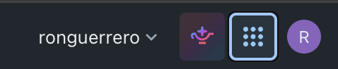
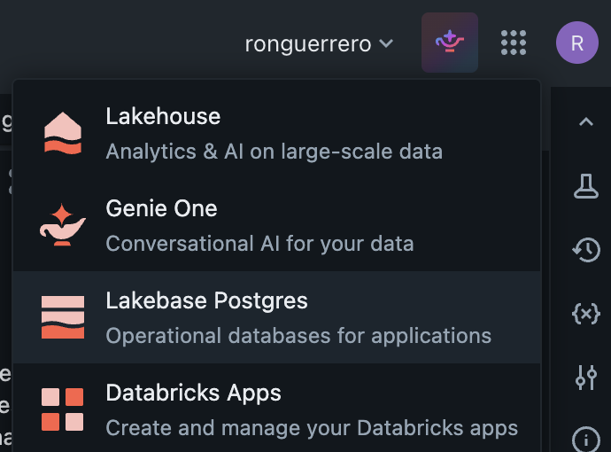
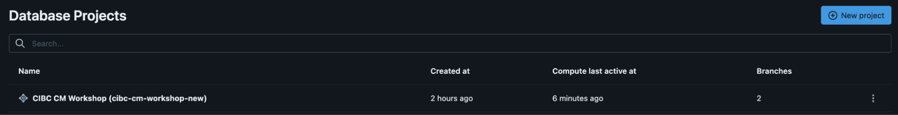
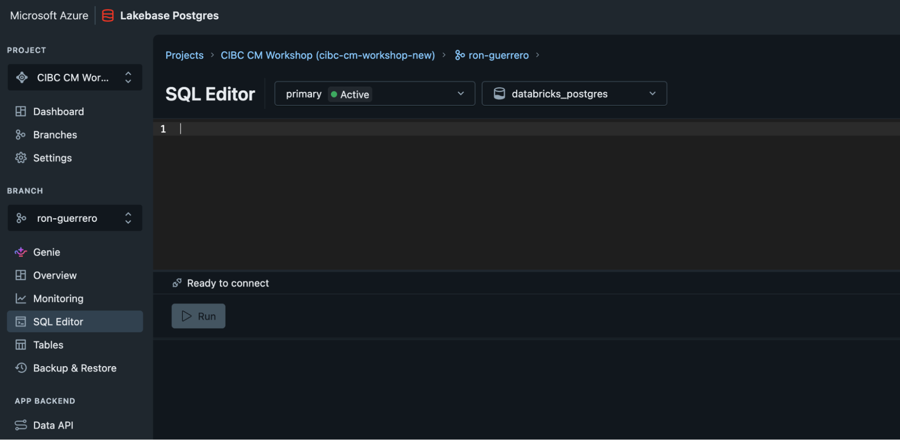

# Exercise 1 — Getting to Know Lakebase

**Track:** Foundations &nbsp;|&nbsp; **Genie Code:** none (guided UI walkthrough) &nbsp;|&nbsp; **Time:** ~30 min

## What you'll learn

You're a CIBC Capital Markets coverage officer / trader, and Lakebase is about to become the
operational database behind your desk's apps and agents. Before you write a line of code, this
exercise gets you comfortable with the platform: what Lakebase *is*, how to find your project, and
how to run a query against it from the built-in SQL Editor.

By the end you will be able to:

- Explain what Lakebase is and where it fits alongside the lakehouse.
- Navigate your Lakebase **project**, its **branches**, and its **compute endpoint** in the UI.
- Run SQL against your branch from the **SQL Editor**.
- Recognize the operational features (autoscaling, scale-to-zero, branching, PITR, Unity Catalog
  sync) you'll use hands-on in later exercises.

> **Before you start:** your facilitator has already run `scripts/facilitator_setup_notebook`, so the shared
> workshop project exists and **you have your own branch** in it — `br · <username>`, an isolated
> copy-on-write clone with its own compute endpoint. Every exercise connects to your branch
> automatically. (Inside your branch your tables live in schema **`cm_<username>`**.) If you can't see
> the project or your branch, tell your facilitator before moving on.

---

## What is Lakebase? (2-minute orientation)

**Lakebase is fully-managed PostgreSQL (Postgres 16/17), integrated into the Databricks lakehouse.**
It's built for **OLTP** — the fast, transactional reads and writes that power applications, agents,
and low-latency lookups — sitting right next to the analytical Delta tables you already know.

For a capital markets desk, that means the *same* platform holds your analytical history **and** the
operational store your trading apps, dashboards, and coverage-desk agents hit in real time. Key
things that make it different from a database you'd have to run yourself:

| Feature | What it means for your desk |
|---|---|
| **Managed Postgres** | Real Postgres — pgvector, JSONB, triggers, the drivers and tools you already use. No servers to patch. |
| **Autoscaling compute** | Capacity follows load — a quiet book costs little, a busy open scales up. |
| **Scale-to-zero** | Idle branches suspend and cost ~nothing; they wake automatically on the next connection. |
| **Branching** | Instant, isolated copies of your database — like Git for data — to test a schema change or a migration safely (Exercise on this later). |
| **Point-in-time restore (PITR)** | Recover to a moment before a bad write (later exercise). |
| **Unity Catalog integration** | Governance, lineage, and sync between Lakebase and Delta — one governance model across operational and analytical data. |

Everything below is hands-on — go slowly and click around; you can't break anything.

---

## Step 1 — Open your Lakebase project

1. In the **top-right** of the Databricks workspace, click the **9-dots app launcher**.

   

2. Choose **Lakebase Postgres** ("Operational databases for applications").

   

3. On the **Database Projects** page, open the shared workshop project your facilitator named — e.g.
   **CIBC CM Workshop** (`cibc-cm-workshop-…`). The **Branches** column shows how many branches it holds.

   

4. Open the **Branches** view and find **your** branch — **`br · <username>`** (`<username>` is your
   email's local-part; e.g. `sofia.martins@…` → `sofia-martins`). This is your isolated sandbox; the
   shared **production** branch belongs to the facilitator. You'll explore its compute in Step 2.

**✓ Check:** you can see the shared project and your own branch **`br · <username>`** listed under it.

---

## Step 2 — Explore branches and compute

1. Open the **Branches** view. A branch is an isolated, copy-on-write clone of the database. You'll
   see the shared **production** branch (the facilitator's) and **your own** branch `br · <username>`,
   forked from it — everything you do this workshop happens on your branch.
2. Open **your branch's** **endpoint / compute** details. Note the **capacity** and the
   **current state** — you'll likely see `IDLE` if nobody has connected recently.
3. **IDLE is normal.** A non-production branch (and a quiet project) **scales to zero** to save cost,
   and **wakes automatically** the moment a client connects. You don't "start" it manually.

> 📸 *Optional screenshot — endpoint details: capacity plus the current (often IDLE) state that wakes on connect. Facilitators can add `docs/images/ex1-lakebase-branch-endpoint.png`.*

**✓ Check:** you can read your endpoint's **host** and its **state** (`ACTIVE`, `IDLE`, or
`DEGRADED` — all mean "ready to connect").

---

## Step 3 — Run SQL from the built-in SQL Editor

Lakebase has a **SQL Editor** built right into the UI and wired to your branch — no local tooling,
drivers, or connection strings needed.

1. In your branch's left nav, click **SQL Editor**.
2. Check the two selectors at the top: they should point at **your own branch's endpoint** and the
   **`databricks_postgres`** database. A green **Active** badge means the endpoint is awake and ready.

   

3. **Optional — let Genie write some data for you.** Click **Genie** in the branch nav and ask, in
   plain English:

   > generate a capital market positions table with 100 records

   Then return to the SQL Editor and `SELECT` from the new table. This is just a taste of Genie writing
   straight to Lakebase — **Exercise 2** generates the full capital-markets dataset.

4. Now run each statement below, one at a time. They work even against an empty schema:

```sql
-- Which Postgres are we on?
SELECT version();

-- Who am I connected as? (your Databricks identity IS your Postgres role)
SELECT current_user, current_database();

-- Where will unqualified table names resolve? (your search_path)
SHOW search_path;

-- What schemas exist in this database?
SELECT schema_name
FROM information_schema.schemata
ORDER BY schema_name;

-- Create your workshop schema if it isn't there yet, then confirm it
CREATE SCHEMA IF NOT EXISTS cm_<username>;
SELECT schema_name FROM information_schema.schemata WHERE schema_name = 'cm_<username>';

-- List tables in your schema (empty for now — Exercise 2 fills it)
SELECT table_name
FROM information_schema.tables
WHERE table_schema = 'cm_<username>'
ORDER BY table_name;
```

> Replace `cm_<username>` with your actual schema (e.g. `cm_sofia_martins`). Use underscores, not
> hyphens — Postgres schema names use underscores even though the project id uses hyphens.

**✓ Check:** `SELECT version()` returns a PostgreSQL 16/17 banner, `current_user` shows your email,
and your `cm_<username>` schema now appears in the schema list.

---

## Step 4 — Peek at monitoring and settings (light)

1. Back on the project, open **Monitoring** (or **Metrics**). Skim what's tracked — connections,
   compute usage, storage. This is where you'd watch a busy desk during market hours.
2. Open **Settings / Details** and note the project's Postgres version and endpoint. Notice there's
   **nothing to provision or size manually** — the platform handles it.

> 📸 *Optional screenshot — Monitoring: connection count and compute usage, useful during market-hours load. Facilitators can add `docs/images/ex1-lakebase-monitoring.png`.*

**✓ Check:** you found the monitoring view and can name one metric it shows.

---

## Step 5 (optional) — How an external tool would connect

You'll do this for real in **Exercise 2**, but it's worth seeing now. Open the **App Connect** (a.k.a.
**Connect** / **Connection details**) dialog on your branch.

- For **notebooks and apps**, you connect with your Databricks identity and a short-lived **OAuth
  token** (this is what `labs/_setup.py`'s `get_connection()` does — no stored password).
- For **interactive desktop clients** (psql, DBeaver, pgAdmin), you can instead create a native
  **Postgres password role** right from this dialog.

> 📸 *Optional screenshot — App Connect: host and database details, plus the option to mint a native Postgres role. Facilitators can add `docs/images/ex1-app-connect-dialog.png`.*

**✓ Check:** you can locate the **host** and **database** (`databricks_postgres`) you'd hand to a
client — the same values Exercise 2 uses.

---

## Step 6 — Watch your branch autoscale under load

**What you'll learn:** how your branch's compute **autoscales** from a minimum up toward a maximum
under load, **scales to zero** when idle, and so bills **pay-per-use** — the "market open" story for
your desk's operational store.

Your branch endpoint has an autoscaling envelope in **CU** (compute units): a min and a max. Under a
burst it scales up toward max; when quiet it scales down, and a non-production branch suspends to zero
until the next connection.

1. Open **`Autoscale_Load.py`** (in this folder) on serverless and **Run all**. It reads your branch's
   min/max CU, seeds a small `load_orders` table, then fires a concurrent query load (default 16
   workers for ~4 min) at your branch.
2. **In another tab, open Lakebase → your project → your branch → Monitoring** and watch the
   **Compute / CU** graph while the load runs — this is where you *see* the scaling. The notebook also
   prints an endpoint-state timeline every 15s.
3. When the load stops, note the compute settling back down; left idle past its timeout, the branch
   **scales to zero** — you stop paying for compute until the next connection.

> **Facilitator note:** attendee branches need **`max_cu > min_cu`** (e.g. min 1, max 4) for the
> scaling to be visible — if your envelope reads `1 → 1`, ask your facilitator to raise the branch
> endpoint's max. The Databricks SDK reports endpoint *state* and the min/max envelope, not a live CU
> number, which is why the actual curve is watched in the Monitoring UI.

> 📸 *Optional screenshot — the branch Monitoring graph with the CU curve rising under load and
> settling after. Facilitators can add `docs/images/ex1-autoscale-monitoring.png`.*

**✓ Check:** the load ran and reported a query count; in Monitoring, CU rose above `min` during the
load and settled afterward; you can explain min/max CU, scale-to-zero, and pay-per-use.

---

## Recap

You now know what Lakebase is, where your project and branch live, how to query them from the SQL
Editor, and where the operational features (autoscaling, scale-to-zero, branching, PITR, UC sync)
show up in the UI. You even created your `cm_<username>` schema — Exercise 2 will fill it with a
capital-markets dataset.

## What's next

**→ Exercise 2 — Authentication.** You'll connect to this same project from Python (and from an
external tool like VS Code) using OAuth, and use Genie Code to generate a capital-markets dataset
directly into your Lakebase schema.

---

### More screenshots (optional)

Steps 1 and 3 already embed live screenshots (stored in this folder's [`images/`](images/)). The
remaining 📸 callouts in the walkthrough are still optional — a facilitator can capture each from the
live Lakebase UI and drop it into `docs/images/` under the filename shown:

| Filename | What to capture |
|---|---|
| `ex1-lakebase-branch-endpoint.png` | A branch's compute/endpoint details showing capacity + state (ideally `IDLE`). |
| `ex1-lakebase-monitoring.png` | The project Monitoring / Metrics view (connections, compute, storage). |
| `ex1-app-connect-dialog.png` | The App Connect / Connection details dialog (host, `databricks_postgres`, role options). |
| `ex1-autoscale-monitoring.png` | The branch Monitoring graph: the CU curve rising under load and settling after. |
