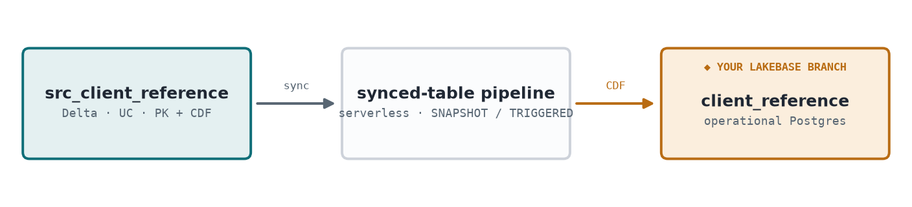

# Exercise 6 — Delta → Lakebase Sync (reverse ETL)

**Build surface:** notebook-first (Genie Code optional) · **Prerequisite:** your Lakebase branch (Ex1–2)

Your lakehouse curates a **client reference / risk-limits** table every night in Delta. The trading
app, though, needs it **live over Postgres**. A Lakebase **synced table** bridges the two: it
continuously replicates a Unity Catalog Delta table into your Lakebase branch as an operational
Postgres table — lakehouse-curated data, served at OLTP latency.



## What you'll learn
- **Reverse ETL with a Lakebase synced table** — Delta (analytical) → Lakebase (operational), managed
  by a serverless Lakeflow sync pipeline (the same machinery online feature stores use).
- Why the source needs a **primary key + Change Data Feed** (the sync reads CDF to replicate).
- **Sync modes** — `SNAPSHOT` (one full load), `TRIGGERED` (incremental on demand), `CONTINUOUS`
  (streaming, always-on) — and when to pick each.
- That the synced table lands on **your branch** and is a real Postgres table an app can read.

## Run the notebook
Open `Delta_To_Lakebase.py` on serverless and **Run all**. It:
1. Builds a curated Delta source `src_client_reference` (9 clients, `risk_limit_cad`) with a PK + CDF.
2. Creates a synced table `client_reference` into **your Lakebase branch** via
   `w.postgres.create_synced_table` (SNAPSHOT first load), and waits for it to come online.
3. Reads it back over Postgres (`get_connection()`) and checks the row count matches the source.
4. Raises Air Canada's risk limit in Delta, re-syncs (TRIGGERED incremental), and shows the new value
   land in Lakebase.

> ⏳ **Provisioning wait (~a few minutes, expected):** creating the sync pipeline + first snapshot is
> fixed overhead — it's the pipeline lifecycle, not the 9 rows. Not a hang.

### Optional — generate it with Genie
Fresh Genie Code chat on a serverless notebook, paste:

> Create a Databricks notebook that syncs a Unity Catalog Delta table into my Lakebase branch as an
> operational Postgres table (reverse ETL). `%run ../_setup` for helpers (`w`, `PROJECT_ID`,
> `USER_BRANCH`, `PG_DATABASE`, `UC_CATALOG`, `UC_SCHEMA`, `get_connection`). Steps: (1) build a Delta
> table `{UC_CATALOG}.{UC_SCHEMA}.src_client_reference` (i.e. your workshop catalog + your `cm_<me>`
> schema, both from `_setup`) — 9 CIBC capital-markets clients with `client_id` PK,
> `legal_name`, `sector`, `credit_rating`, `risk_limit_cad`, `coverage_officer`, `updated_at` — with a
> PRIMARY KEY and Change Data Feed enabled. (2) Create a Lakebase synced table `client_reference`
> from it with `w.postgres.create_synced_table` (`SyncedTable` + spec: `source_table_full_name`,
> `primary_key_columns=["client_id"]`, `branch=USER_BRANCH`, `postgres_database="databricks_postgres"`,
> `scheduling_policy=SNAPSHOT`, `create_database_objects_if_missing=True`, a `new_pipeline_spec`), and
> wait for it to come online. (3) Verify by reading `client_reference` over psycopg and comparing
> the count to the Delta source. (4) Update a row in Delta, re-sync (TRIGGERED), and show it propagate.

---

## Optional — do the sync yourself from the UI (Genie for the data, Catalog Explorer for the sync)

The main lab creates the synced table *in code*. This optional path is the point-and-click version:
**Genie Code generates a dummy table, then you set up the synced table in the Catalog Explorer UI** — the
same way you'd wire up a real reverse-ETL without writing the SDK call.

**1. Generate a dummy table with Genie Code.** In a fresh Genie Code chat on a serverless notebook, paste:

> Create a Databricks notebook that generates a small **dummy capital-markets** table in Unity Catalog
> for a sync demo. `%run ../_setup` to get `UC_CATALOG` and `UC_SCHEMA`. Build a Delta table
> `{UC_CATALOG}.{UC_SCHEMA}.sync_demo` with columns `instrument_id STRING`, `ticker STRING`,
> `asset_class STRING`, `last_price DOUBLE`, `currency STRING`, `updated_at TIMESTAMP`, and insert ~15
> dummy rows (a mix of equities, FX, and commodities). Declare `instrument_id` as the **PRIMARY KEY**
> and enable **Change Data Feed** (`delta.enableChangeDataFeed = true`) so the table can be synced in
> Triggered or Continuous mode. Print the fully-qualified table name at the end.

**2. Create the synced table in the UI.** These steps follow the Databricks docs
([Serve lakehouse data with synced tables](https://docs.databricks.com/aws/en/oltp/projects/sync-tables)):

1. In the workspace sidebar, open **Catalog**.
2. Navigate to your table: `<catalog>` → `cm_<you>` → **`sync_demo`**.
3. On the table page, click **Create ▸ Synced table**.
4. In the **Create synced table** dialog:
   - **Synced table name** — it's created in the **same catalog/schema as the source**; name it e.g. `sync_demo_online`.
   - **Database type** — choose **Lakebase Serverless (Autoscaling)**.
   - **Sync mode** — pick one:
     - **Snapshot** — one-time full copy (simplest; no CDF needed).
     - **Triggered** — scheduled/on-demand incremental updates.
     - **Continuous** — real-time streaming, seconds of latency.
   - **Project, branch, and database** — select your Lakebase **project**, **your branch** (`br · <you>`), and the **`databricks_postgres`** database.
   - **Primary key** — confirm the auto-detected **`instrument_id`**. (PK columns can't be null; rows with a null PK are excluded.)
   - **Timeseries key** *(optional)* — leave blank unless rows can share a primary key (it keeps only the latest row per key).
5. Create it and wait — the **Overview** tab of the new synced table shows **sync status, pipeline status, and last-sync timestamp**.

> **Prerequisites (per the docs):** for **Triggered** or **Continuous** you need **Change Data Feed** on
> the source (the Genie notebook enables it); **Snapshot** doesn't. You also need `USE SCHEMA` +
> `CREATE TABLE` on the target schema — you own your `cm_<you>` schema, so that's covered.

**3. Read it back on your branch.** In the Lakebase **SQL Editor** (your branch) or over psycopg:
```sql
SELECT * FROM cm_<you>.sync_demo_online ORDER BY instrument_id;
```
You should see the 15 dummy rows now living as an operational Postgres table on your branch — created
entirely through Genie + the UI, no `create_synced_table` call.

---

## ✓ Validation
- Delta source `src_client_reference` has 9 rows, a primary key, and CDF enabled.
- `client_reference` exists on **your branch** and its row count matches the source.
- After raising Air Canada's limit and re-syncing, Lakebase shows **CAD 300,000,000**.

## Notes & docs
- The synced table is **project/branch-scoped** and materializes as a Postgres table — an app reads it
  with the same OAuth connection pattern as every other lab.
- Synced tables / reverse ETL into Lakebase is an actively evolving surface — check the Databricks
  docs for the current API and any **Preview** status:
  [Sync data to Lakebase / synced tables](https://docs.databricks.com/aws/en/oltp/) ·
  [Online tables & sync](https://docs.databricks.com/aws/en/machine-learning/feature-store/online-feature-store).

## What's next
**Exercise 7 — Lakebase → Delta (SCD Type 1)** is the reverse direction: it captures changes to your
operational Postgres tables (`positions`, `limits`) back into the lakehouse — via **Lakebase CDF**, which
auto-materializes them as `lb_*_history` Delta tables — and transforms them into **SCD1** analytical tables.
